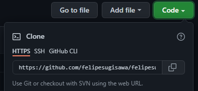

# infoGIT

GitHub is a web site that you can (see files in cloud)                                                                                                                       
- create account: https://github.com/                                                                                                                                           
 
Git is an  apk that for save to (the cloud > pc / pc > cloud)                                                                                                                               
- install: https://git-scm.com/downloads
------------------------------------------------------------------------------------------------------------------------------                                                                                                                                                                                 
### Commands
1. git clone https://urlrepository

2. git add .
3. git commit -m "example"
4. git push
                                                                                                                                                                                 
------------------------------------------------------------------------------------------------------------------------------                                                                                                                                                                                                                 
### clona um projeto (nuvem > pc)
  
  
git clone http://urlrepository

### adiciona atualizacoes(pc > nuvem)
- git add . (iniciar git)
- git commit -m "txt" (comentario)
- git push (subir para gitHub)

#### cometar sobre atualizacao
```
git commit -m "atualizado"
```
#### apenas salva (pc > nuvem)
```
git push 
ou
git push origin/master
```
#### atualizar um projeto ja salvo (nuvem > pc)
```
git pull
```
------------------------------------------------------------------------------------------------------------------------------
                                                                                                                                                                                
git init (inicializar o rep)
git checkout origin/master
git checkout -b branch (criar branch)
git push -d nomeBranch (deletar branch local)
git push --delete nomeBranch (deletar branch remota)
git push -u origin nome (dar o push na branch )
git push -u origin nomebranch (subir uma branch)
git pull (puxar atualizacoes)
git checkout nameBranch (entrar na branch) ex: CW-569
```
